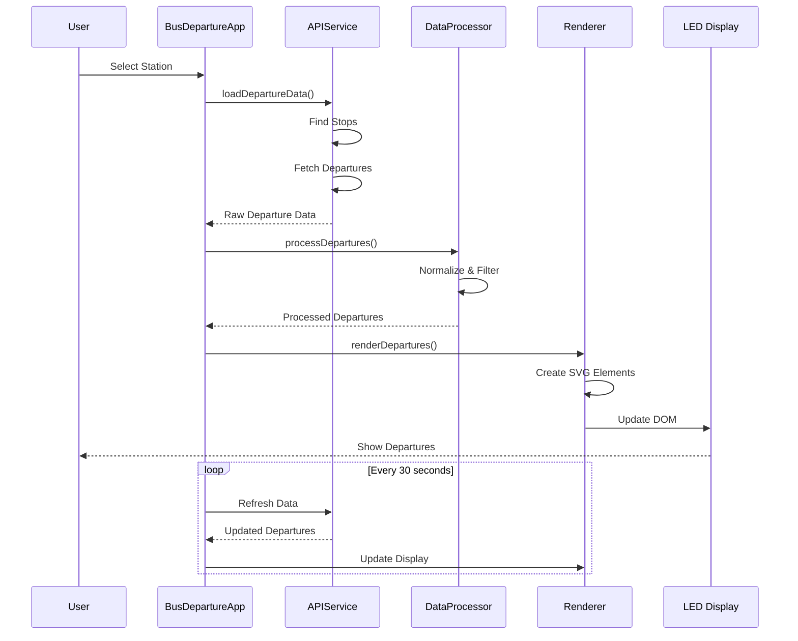

# BVG Departures Board

A real-time LED-style departure board for Berlin's public transport system (BVG/VBB). This single-page web application displays upcoming bus, tram, and train departures with an authentic LED display aesthetic.

## Features

- **Real-time Departure Information**: Fetches live data from BVG/VBB public transport APIs
- **LED Display Aesthetic**: Authentic LED-style rendering with glow effects and dot patterns
- **Station Selection**: Interactive modal with autocomplete for selecting stations
- **Auto-refresh**: Updates departure information every 30 seconds
- **Responsive Design**: Adapts to different screen sizes with dynamic font scaling
- **Scrolling Text**: Long destination names scroll smoothly across the display
- **Single-file Output**: Built as a self-contained HTML file for easy deployment

## Technology Stack

- **Vanilla JavaScript** (ES6 Modules)
- **Vite** - Modern build tool for bundling
- **vite-plugin-singlefile** - Inlines all assets into a single HTML file
- **BVG/VBB Transport REST API** - Public transport data source

## Project Structure

```
BVG-Departures-Board/
├── src/
│   ├── index.html              # Entry point (references modules)
│   ├── styles/
│   │   └── main.css            # All CSS styles
│   └── js/
│       ├── config.js           # Configuration constants
│       ├── dom.js              # DOM element references
│       ├── state-manager.js    # StateManager class
│       ├── text-utils.js       # TextUtils class
│       ├── led-svg-generator.js # LEDSVGGenerator class
│       ├── api-service.js      # APIService class
│       ├── data-processor.js   # DataProcessor class
│       ├── renderer.js         # Renderer class
│       ├── app.js              # BusDepartureApp class
│       └── main.js             # Application initialization
├── dist/                        # Build output (gitignored)
│   └── index.html              # Single bundled file
├── vite.config.js              # Vite configuration
├── package.json                # Dependencies and scripts
└── README.md                   # This file
```

## Architecture

### Data Flow



## Installation & Setup

### Prerequisites

- Node.js (v16 or higher)
- npm (v7 or higher)

### Installation Steps

1. **Clone or download the repository**

2. **Install dependencies**:
   ```bash
   npm install
   ```

3. **Configure the default station** (optional):
   Edit `src/js/config.js` and change the `stopQuery` value:
   ```javascript
   export const CONFIG = {
     stopQuery: "Your Station Name",  // Change this
     // ... other config
   };
   ```

## Development

### Running the Development Server

```bash
npm run dev
```

The application will be available at `http://localhost:5173` (or the next available port).

## Build & Deployment

### Building for Production

```bash
npm run build
```

This creates a single self-contained HTML file in the `dist/` directory: `dist/index.html`

### Preview Production Build

```bash
npm run preview
```

### Deployment

The repository includes a GitHub Actions workflow for automatic deployment to GitHub Pages. The built `dist/index.html` file can also be deployed to any static hosting service.

## Configuration

Edit `src/js/config.js` to customize the application:

```javascript
export const CONFIG = {
  stopQuery: "Rotkopfweg",        // Default station name
  maxRows: 5,                     // Maximum departures to display
  dotBaselineRows: 6,             // Base rows for LED dot calculation
  lookAheadMinutes: 60,           // Minutes ahead to search
  refreshInterval: 30000,          // Refresh interval (30 seconds)
  textBoost: 1.21,                // Text size amplification
  ledScale: 0.7,                   // LED dot scale
  attenuateGlow: 0.9               // LED glow attenuation
};
```
