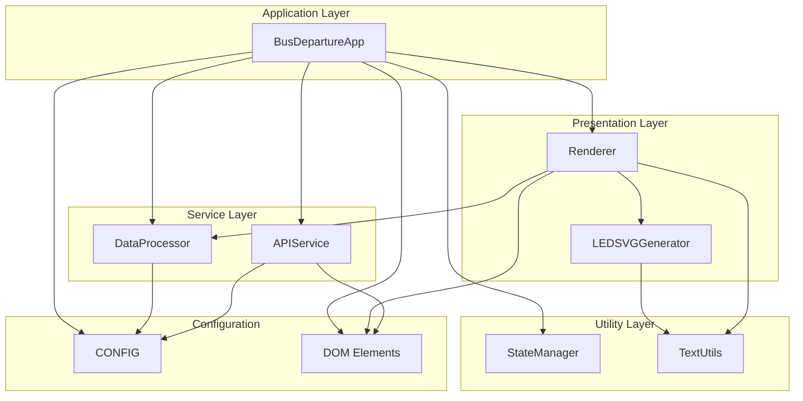
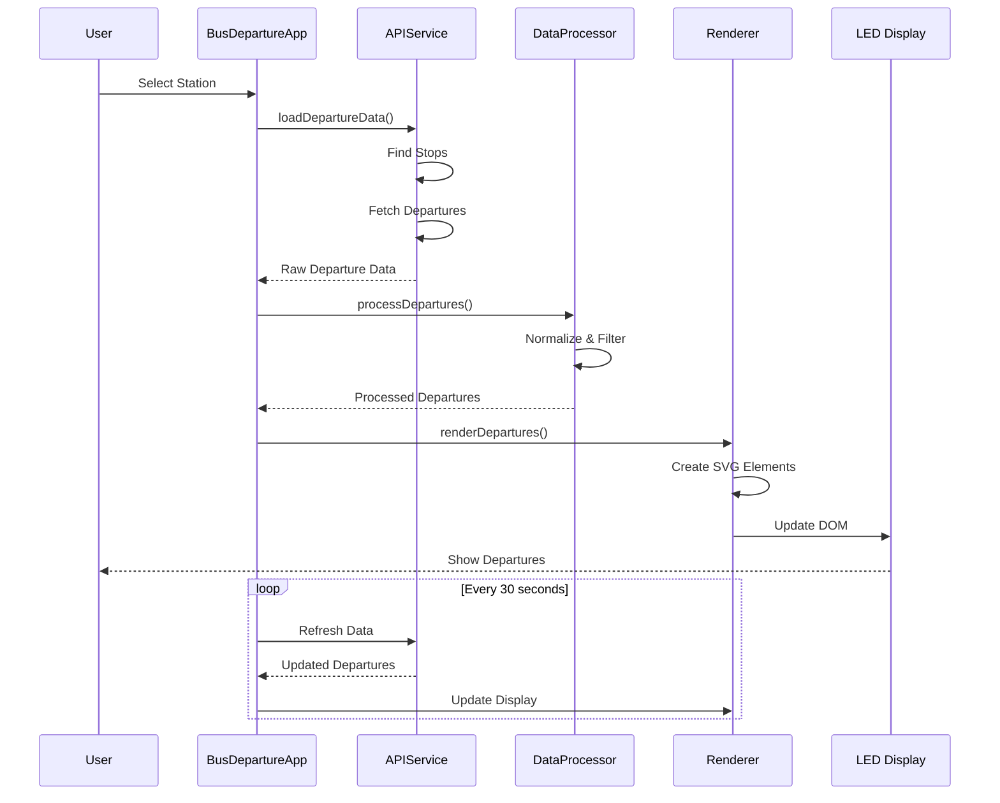
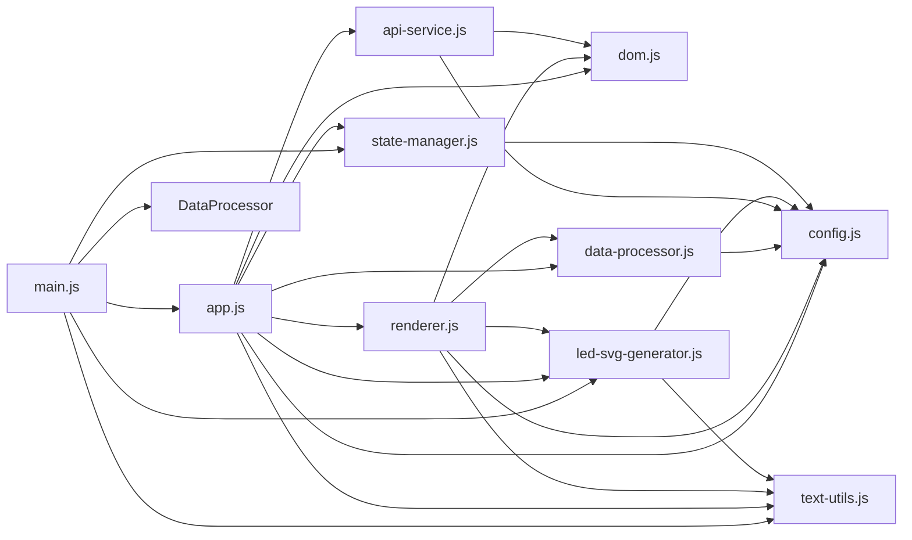
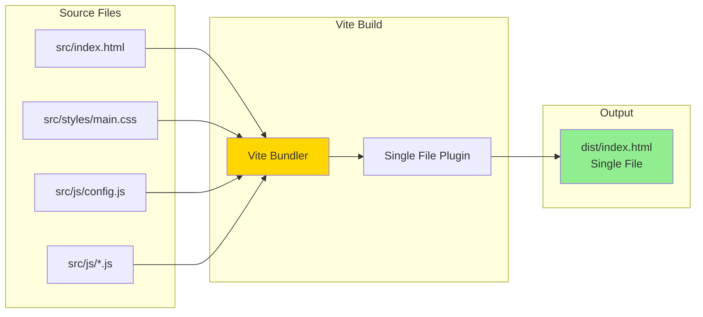

# BVG Departures Board

A real-time LED-style departure board for Berlin's public transport system (BVG/VBB). This single-page web application displays upcoming bus, tram, and train departures with an authentic LED display aesthetic.

## Features

- **Real-time Departure Information**: Fetches live data from BVG/VBB public transport APIs
- **LED Display Aesthetic**: Authentic LED-style rendering with glow effects and dot patterns
- **Station Selection**: Interactive modal with autocomplete for selecting stations
- **Auto-refresh**: Updates departure information every 30 seconds
- **Responsive Design**: Adapts to different screen sizes with dynamic font scaling
- **Scrolling Text**: Long destination names scroll smoothly across the display
- **Visual Feedback**: Blinking animation for arriving-now departures
- **Single-file Output**: Built as a self-contained HTML file for easy deployment

## Technology Stack

- **Vanilla JavaScript** (ES6 Modules)
- **Vite** - Modern build tool for bundling
- **vite-plugin-singlefile** - Inlines all assets into a single HTML file
- **BVG/VBB Transport REST API** - Public transport data source

## Project Structure

```
BVG-Departures-Board/
├── src/
│   ├── index.html              # Entry point (references modules)
│   ├── styles/
│   │   └── main.css            # All CSS styles
│   └── js/
│       ├── config.js           # Configuration constants
│       ├── dom.js              # DOM element references
│       ├── state-manager.js    # StateManager class
│       ├── text-utils.js       # TextUtils class
│       ├── led-svg-generator.js # LEDSVGGenerator class
│       ├── api-service.js      # APIService class
│       ├── data-processor.js   # DataProcessor class
│       ├── renderer.js         # Renderer class
│       ├── app.js              # BusDepartureApp class
│       └── main.js             # Application initialization
├── dist/                        # Build output (gitignored)
│   └── index.html              # Single bundled file
├── index.html.original         # Backup of original file
├── vite.config.js              # Vite configuration
├── package.json                # Dependencies and scripts
└── README.md                   # This file
```

## Architecture

### Component Architecture



### Data Flow



### Module Dependencies



## Build Process

### Development to Production Pipeline



### Build Steps

1. **Module Resolution**: Vite resolves all ES6 imports
2. **CSS Processing**: CSS is extracted and inlined
3. **JavaScript Bundling**: All modules are bundled into a single script
4. **Asset Inlining**: All assets are inlined into the HTML
5. **Minification**: Code is minified for production
6. **Output**: Single self-contained HTML file

## Installation & Setup

### Prerequisites

- Node.js (v16 or higher)
- npm (v7 or higher)

### Installation Steps

1. **Clone or download the repository**

2. **Install dependencies**:
   ```bash
   npm install
   ```

3. **Configure the default station** (optional):
   Edit `src/js/config.js` and change the `stopQuery` value:
   ```javascript
   export const CONFIG = {
     stopQuery: "Your Station Name",  // Change this
     // ... other config
   };
   ```

## Development

### Running the Development Server

```bash
npm run dev
```

This starts Vite's development server with:
- Hot Module Replacement (HMR)
- Fast refresh on file changes
- Source maps for debugging

The application will be available at `http://localhost:5173` (or the next available port).

### Development Workflow

1. Make changes to files in `src/`
2. Changes are automatically reflected in the browser
3. Test functionality in the browser
4. Build for production when ready

## Build & Deployment

### Building for Production

```bash
npm run build
```

This creates a single self-contained HTML file in the `dist/` directory:
- `dist/index.html` - Ready for deployment

### Preview Production Build

```bash
npm run preview
```

This serves the production build locally for testing.

### Deployment Options

#### Static Hosting

The built `dist/index.html` file can be deployed to any static hosting service:

- **GitHub Pages**: Upload `dist/index.html` to your repository
- **Netlify**: Deploy the `dist/` folder
- **Vercel**: Deploy the `dist/` folder
- **Any Web Server**: Simply upload `dist/index.html` to your server

#### Deployment Steps

1. Build the project: `npm run build`
2. Upload `dist/index.html` to your hosting service
3. Configure your server to serve `index.html` for all routes (for SPA routing if needed)

### File Size

The built file is approximately:
- **Uncompressed**: ~47 KB
- **Gzipped**: ~12 KB

## Configuration

### Available Configuration Options

Edit `src/js/config.js` to customize the application:

```javascript
export const CONFIG = {
  stopQuery: "Rotkopfweg",        // Default station name
  maxRows: 5,                     // Maximum departures to display
  dotBaselineRows: 6,             // Base rows for LED dot calculation
  lookAheadMinutes: 60,           // Minutes ahead to search
  refreshInterval: 30000,          // Refresh interval (30 seconds)
  textBoost: 1.21,                // Text size amplification
  ledScale: 0.7,                   // LED dot scale
  attenuateGlow: 0.9               // LED glow attenuation
};
```

### API Endpoints

The application uses the following public transport APIs:

- **Primary**: `https://v6.bvg.transport.rest` (Berlin)
- **Fallback**: `https://v6.vbb.transport.rest` (Brandenburg)

These are public APIs and don't require authentication.

## How It Works

### LED Display Rendering

The LED effect is achieved through:

1. **SVG Pattern Generation**: Creates dot patterns that simulate LED pixels
2. **Radial Gradients**: Generates glow effects around each dot
3. **SVG Filters**: Applies blur and dilation for realistic LED appearance
4. **CSS Animations**: Adds subtle flicker effects

### Text Handling

- **Dynamic Font Sizing**: Calculates optimal font size based on available space
- **Text Truncation**: Uses binary search for efficient text truncation
- **Scrolling Text**: Automatically scrolls long destination names
- **Canvas Measurement**: Precisely measures text width for layout

### Data Processing

- **Normalization**: Converts API data to a consistent format
- **Filtering**: Removes cancelled or invalid departures
- **Validation**: Checks data freshness and validity
- **Sorting**: Orders departures by time

## Browser Support

- Chrome/Edge (latest)
- Firefox (latest)
- Safari (latest)
- Any modern browser with ES6 module support

## Contributing

Contributions are welcome! To contribute:

1. Fork the repository
2. Create a feature branch
3. Make your changes
4. Test thoroughly
5. Submit a pull request

## License

This project is open source and available for use.

## Acknowledgments

- **BVG/VBB**: For providing the public transport API
- **Vite**: For the excellent build tooling
- **Inter Font**: For the typography

---

Built with ❤️ for Berlin's public transport users

